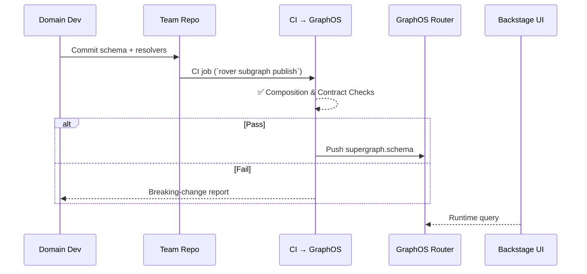

# GraphQL Federation for Backstage (2025 Edition)

_Author: Your Platform Engineering Team_  
_Target audience: Engineering leadership, domain-team developers, architects_  
_Presentation style: copy-paste into Miro / Mural as individual frames_

---

## 1 Opening – Why We’re Here
- **Vision :** Backstage as the _always-current_ developer portal—without a gatekeeper bottleneck.  
- **Reality :** Tiny platform team vs. huge enterprise; domain teams own the truth but rarely contribute.  
- **Key insight :** **GraphQL Federation** (via GraphOS Router) offers both a **technical** and **organizational** federation model.

---

## 2 “As-Is” Backstage Data Model

```mermaid
flowchart LR
  subgraph Our_MonoRepo["Our Mono-repo"]
    direction TB
    Core[Backstage Core] --> PluginA[Plugin A]:::ext
    Core --> PluginB[Plugin B]:::ext
  end
  classDef ext fill:#ffdede,stroke:#333;

  DS1[Data Source A] -.-> PluginA
  DS2[Data Source B] -.-> PluginB
````

**Pain points**

* External teams must *fork* our repo, learn our CI, open PRs.
* Code-ownership confusion → plugins drift as upstream APIs evolve.
* Platform team reviews every change → scaling ceiling.

---

## 3 Problem Framing

| Friction                  | Impact                           |
| ------------------------- | -------------------------------- |
| Mono-repo onboarding      | Weeks of ramp-up per contributor |
| Broken sense of ownership | Orphaned plugins, stale UIs      |
| Duplicate data contracts  | DRY violations across teams      |
| Centralised PR review     | Platform team becomes bottleneck |

(Encourage adding sticky-note anecdotes during live session.)

---

## 4 GraphQL Federation 2 + GraphOS Router Primer

* **GraphOS Router** (Rust binary) composes many **subgraphs** into a *single schema* at runtime.
* Each domain team retains its own \_schema\_\_and *resolvers* in its **own repo**.
* Router enforces contracts, query planning, caching, auth, rate limits.
* **GraphOS Registry** & **Contracts** add CI checks and client-specific slices.

---

## 5 “Future” Architecture for Backstage

```mermaid
flowchart TD
  %% Client
  Backstage["Backstage UI\n(Type-safe GQL Client)"]

  %% Router
  subgraph RouterPlane["GraphOS Router  •  'Phrase Gateway'"]
    direction LR
    Router[Query Planner<br/>Enforcement<br/>Caching]
    style Router fill:#e8f6ff,stroke:#0b70b3
  end

  %% Subgraphs
  subgraph Domains["Team-Owned Subgraphs"]
    direction LR
    AppSG[Application]:::sg
    BacklogSG[Backlog]:::sg
    IncidentSG[Incident]:::sg
  end
  classDef sg fill:#fff6e5,stroke:#d18d00

  %% Registry
  Registry["GraphOS Registry"]

  %% Edges
  Backstage -- "single operation" --> Router
  Router --> AppSG & BacklogSG & IncidentSG
  Registry -. "schema updates / checks" .-> Router
```

---

## 6 Developer Workflow



---

## 7 Benefits Matrix

| Dimension                    | Today (Mono-repo) | Federated Router | **With Contracts**        |
| ---------------------------- | ----------------- | ---------------- | ------------------------- |
| Ownership                    | Central           | Domain-owned     | —                         |
| Time-to-value                | Slow PR cycle     | Minutes via CI   | —                         |
| Type safety                  | Ad-hoc            | End-to-end SDK   | —                         |
| Caching / batching           | Plugin-specific   | Uniform @Router  | —                         |
| Re-use outside Backstage     | Low               | High             | Higher (client slice)     |
| Client-specific surface area | N/A               | Whole graph      | *Contract scope → leaner* |

---

## 8 Constraints & Mitigations

| Risk / Constraint                     | Mitigation                                                                    |
| ------------------------------------- | ----------------------------------------------------------------------------- |
| **Skill gap – GraphQL/Federation**    | Internal workshops, reference repo, pair-programming                          |
| **Router as SPOF**                    | HA deployment or GraphOS Cloud Router; built-in health probes                 |
| **Query misuse / N + 1**              | Depth & cost limits, Apollo Studio insights, DataLoader patterns in subgraphs |
| **Version skew (Router ↔ Subgraphs)** | Keep Router ≥ v1.60; CI schema checks enforce Federation 2 compatibility      |
| **Governance & schema bloat**         | API review guild for new root types; Contracts restrict surface per client    |

---

## 9 Talking-Point Additions

* **Performance:** Rust Router ≈ 10× faster than legacy Node gateway.
* **Extensibility:** Rhai scripts / WASM co-processors for custom auth, rate limiting, SLOs.
* **Shared asset:** Same Router powers other internal apps & CLIs, concentrating caching and audit logic.
* **Skill investment ROI:** Once teams learn Federation, they gain a reusable enterprise pattern.

---

## 10 Call to Action

> **“If your team owns data, own your subgraph.”**

* Volunteer a pilot subgraph—pair with the platform team for a one-sprint implementation.
* Leaders: sponsor GraphQL Federation workshops.
* Platform team commits to delivering dev Router + CI templates for teams by **July 1 2025**.

---

## Appendix A Quick Reference – Terminology Swap

| Legacy term        | 2025 term          | One-liner                                   |
| ------------------ | ------------------ | ------------------------------------------- |
| Supergraph Gateway | **GraphOS Router** | Rust runtime that serves the composed graph |
| Managed Federation | **GraphOS Cloud**  | Optional SaaS for schema delivery / metrics |
| (none)             | **Contract**       | Graph slice tailored to a specific client   |

---

## Appendix B Sample Contract Definition

```bash
# Publish Backlog subgraph with a contract variant for Backstage
rover subgraph publish my-graph@current \
  --schema backlog.graphql \
  --name backlog \
  --routing-url https://backlog.api.example.com/graphql \
  --contract-tag backstage
```

---

### Usage Tips for Miro / Mural

1. **Frame per section** – conversion from Markdown headings = one board frame.
2. **Colour language** – red =pain, green =benefit, blue =architecture, purple =GraphOS.
3. Export Mermaid blocks as SVG (rover render or vscode plugin) for crisp visuals.
4. Encourage dot-votes on the Benefits or Risks frame to drive discussion.

---