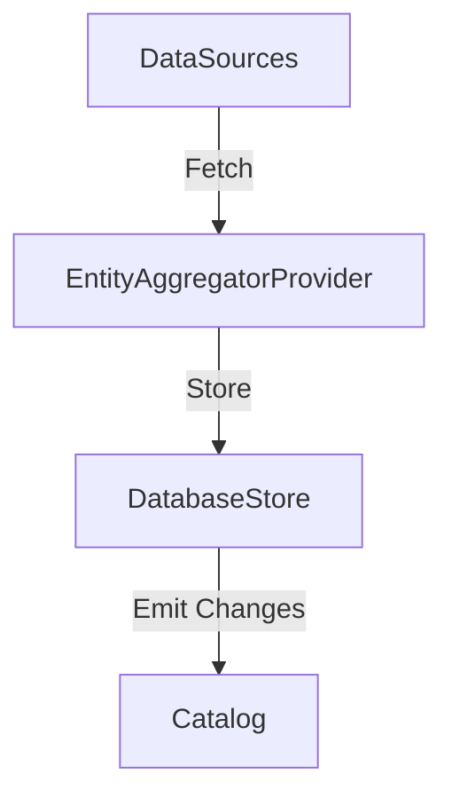

# Entity Aggregator Module for Backstage Catalog

This backend module for Backstage provides a flexible system for aggregating entity data from multiple sources while managing priority, scheduling, and efficient updates.

## Features

- **Multi-Source Entity Management**: Aggregate entities from multiple data sources
- **Priority-Based Conflict Resolution**: Handle conflicting entity definitions through configurable priority scores
- **Efficient Change Detection**: Content-based hash tracking to only emit changed entities
- **Batched Processing**: Efficient handling of large datasets through batched operations
- **Configurable Refresh Schedules**: Each data source can have its own refresh schedule
- **Delta Updates**: Efficient catalog updates using delta mutations

## Installation

```bash
# From your Backstage root directory
yarn add --cwd packages/backend @backstage/plugin-catalog-provider-backend-module-entity-aggregator
```

## Configuration

Add the module to your catalog plugin in `packages/backend/src/plugins/catalog.ts`:

```typescript
import { Entity } from '@backstage/catalog-model';
import { entityAggregatorModule } from '@backstage/plugin-catalog-provider-backend-module-entity-aggregator';

export default async function createPlugin(
  env: PluginEnvironment,
): Promise<Router> {
  const builder = await CatalogBuilder.create(env);

  // Add the entity aggregator module
  builder.addModule(entityAggregatorModule);

  const { processingEngine, router } = await builder.build();
  await processingEngine.start();

  return router;
}
```

## Architecture

### Core Components

1. **EntityAggregatorProvider**
   - Single provider registered with the Backstage catalog
   - Manages the update loop for entity emission
   - Handles delta mutations and conflict resolution

2. **DatabaseStore**
   - Manages entity record persistence
   - Tracks content changes via hashing
   - Handles batched operations efficiently

3. **DataSource Base Class**
   - Abstract base class for implementing data sources
   - Handles scheduling and error management
   - Provides lifecycle hooks for entity processing

### Data Flow



## Creating a Custom Data Source

Implement a custom data source by extending the DataSource class:

```typescript
import { DataSource, DataSourceConfig } from '@backstage/plugin-catalog-provider-backend-module-entity-aggregator';

export class CustomDataSource extends DataSource {
  async fetchEntities(): Promise<Entity[]> {
    // Implement your entity fetching logic
    return [{
      apiVersion: 'backstage.io/v1alpha1',
      kind: 'Component',
      metadata: {
        name: 'example-component',
        annotations: {
          'timestamp': new Date().toISOString(),
        },
      },
      spec: {
        type: 'service',
        lifecycle: 'production',
        owner: 'team-a',
      },
    }];
  }
}
```

## Usage Example

Configure your data sources with different priorities and schedules:

```typescript
const dataSources = [
  new CustomDataSourceA({
    name: 'high-priority-source',
    priority: 100,
    refreshSchedule: '*/5 * * * *', // Every 5 minutes
  }),
  new CustomDataSourceB({
    name: 'low-priority-source',
    priority: 50,
    refreshSchedule: '*/30 * * * *', // Every 30 minutes
  }),
];
```

## Operational Details

- Batched processing of entities for efficient database operations
- Content-based change detection using SHA-256 hashing
- Configurable update intervals for the emission loop
- Automatic conflict resolution based on priority scores
- Delta mutations for efficient catalog updates

## Error Handling

The module implements comprehensive error handling:
- Typed error reporting for data source operations
- Automated retry mechanisms for failed operations
- Detailed logging for debugging and monitoring
- Transaction support for database operations

## Contributing

This module is part of the Backstage Community Plugins ecosystem. Contributions are welcome!

## License

Apache-2.0 © The Backstage Authors
